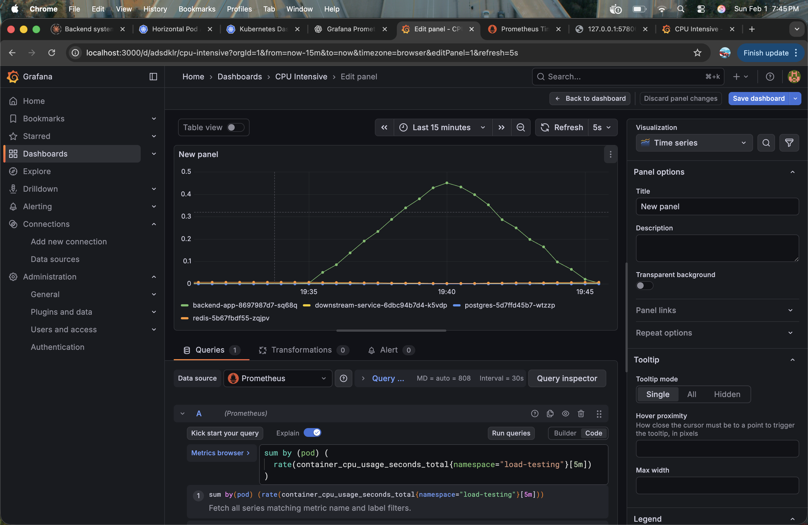
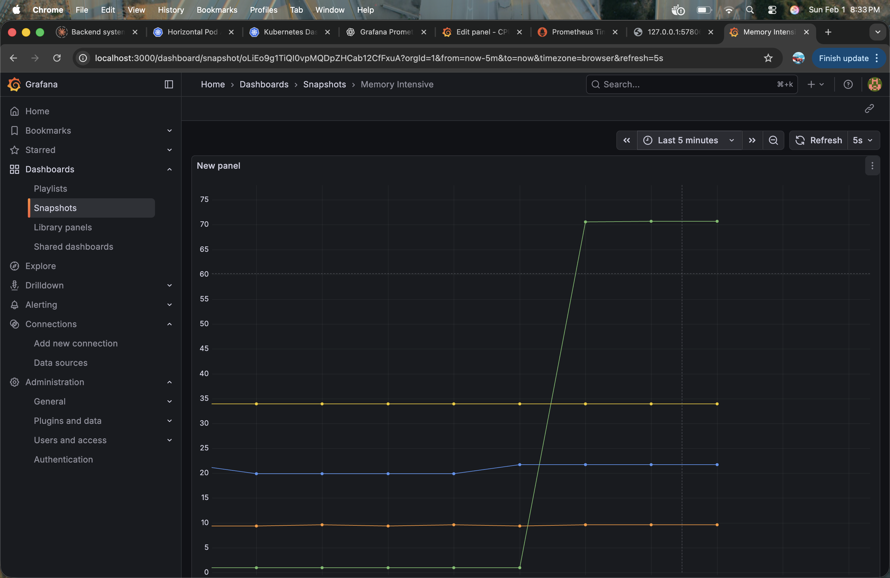
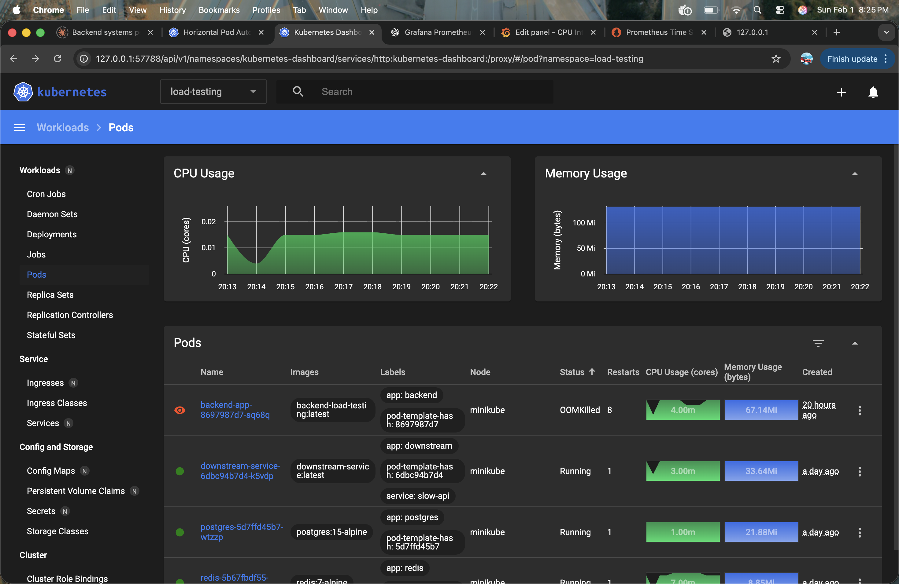

# Backend Under Load

A FastAPI application for testing backend system behavior under different stress conditions. This project demonstrates common failure modes: CPU saturation, memory exhaustion, database pool depletion, and cascading failures from downstream services.

## 📌 What This Repo Does

This is a learning project that intentionally creates failure scenarios to understand how backend systems degrade under load. It includes:

- A **FastAPI application** with multiple test endpoints
- **k6 load testing scripts** for CPU, memory, I/O, database, and cascade failure scenarios
- **Prometheus metrics** for observability
- **Kubernetes manifests** for deployment to Minikube
- **Real test results** showing system behavior under various stress patterns

## 🧪 Load Testing Approach

All tests use **k6**, a load testing tool that simulates concurrent users and measures system behavior.

### Test Scenarios

| Test | Description | Result |
|------|-------------|--------|
| **CPU Stress** | 50 req/s for 5 min, random CPU complexity | Connection resets - system overwhelmed |
| **Memory Stress** | Ramp to 20 VUs, request 10-30 MB allocations | Worse than CPU - rapid failure |
| **Cascade Failure** | Ramp to 100 req/s, downstream service calls | System collapses under cascading failures |
| **DB Pool Exhaustion** | 100 VUs with 30 concurrent DB queries | Requests timeout - connection pool starved |

## 🔍 Observability & Monitoring

**Prometheus** scrapes metrics from the `/metrics` endpoint:
- HTTP request duration and error rates
- Active database connections
- Custom application metrics (complexity, allocations, etc.)

Monitor during tests at: `http://localhost:9090`

## 🚀 Quick Setup

### Prerequisites

```bash
# Install required tools
brew install minikube kubectl k6  # macOS
# or apt-get on Linux
```

### Local Development

```bash
# 1. Install dependencies
pip install -r requirements.txt

# 2. Run the app
python -m uvicorn app.main:app --reload --port 8000

# 3. In another terminal, run a load test
BASE_URL=http://127.0.0.1:8000 k6 run load-tests/cpu-stress.js
```

### Minikube Deployment

```bash
# 1. Start Minikube
minikube start

# 2. Deploy PostgreSQL, Redis, and the app
kubectl apply -f k8s/namespace.yaml
kubectl apply -f k8s/postgres.yaml
kubectl apply -f k8s/redis.yaml
kubectl apply -f k8s/deployment.yaml
kubectl apply -f k8s/service.yaml

# 3. Port-forward to access locally
kubectl port-forward -n load-testing svc/backend 8000:80

# 4. Run load tests (set BASE_URL to your service address)
BASE_URL=http://127.0.0.1:8000 k6 run load-tests/cpu-stress.js
# Or if using port-forward on different port:
# BASE_URL=http://127.0.0.1:57806 k6 run load-tests/cpu-stress.js
```

## 📊 Key Findings

### Single Pod Behavior
- **CPU stress**: System remains operational but with massive error rates when CPU is exhausted
- **Memory stress**: More destructive than CPU - quick memory exhaustion causes widespread failures
- **Database pool**: Creates silent failures - requests hang indefinitely instead of failing fast

### Scaling Impact (Multiple Pods)

When horizontal scaling to **3 pods**, the database connection pool issue **becomes worse**, not better:

- Each pod gets its own connection pool (5 connections per pod)
- With 3 pods: 15 total connections to shared PostgreSQL
- Load distributes across pods, but all compete for same limited database pool
- **Result**: Request timeouts increase as more pods fight for database connections

**Key Insight**: Scaling out without scaling the database bottleneck makes things worse.

## 📁 Project Structure

## 🛠️ Tech Stack

- **Backend**: FastAPI (Python)
- **Load Testing**: k6 
- **Observability**: Prometheus metrics
- **Database**: PostgreSQL
- **Cache**: Redis
- **Orchestration**: Kubernetes / Minikube

## 📂 Directory Structure

```
.
├── app/main.py              # FastAPI app with test endpoints
├── load-tests/              # k6 load test scripts
├── k8s/                     # Kubernetes manifests
└── docker/Dockerfile        # Container image
```

## 🏃 Running Tests

```bash
# Set your app URL (update the port if different)
export BASE_URL=http://127.0.0.1:8000

# CPU stress test
k6 run load-tests/cpu-stress.js

# Memory stress test
k6 run load-tests/memory-stress.js

# Cascade failure test
k6 run load-tests/cascade-failure.js

# Database pool exhaustion test
k6 run load-tests/db-pool-exhaust.js
```

## 🎯 What We Learned

### The Database Bottleneck Problem

The most critical finding: **Horizontal scaling amplifies database pool exhaustion**.

With a single pod at default pool size (5 connections):
- System can handle moderate load
- Database becomes bottleneck at high concurrency

With 3 pods scaled horizontally:
- Connection pool becomes WORSE, not better
- 3 pods × 5 connections = 15 total connections
- All pods compete for same limited PostgreSQL pool
- Load spreads across pods but pools don't scale proportionally
- **Result**: More timeouts, not fewer

**Solution**: Scale database connection pools alongside application scaling, or use a connection pooler like PgBouncer.

### Failure Mode Comparison

| Scenario | Behavior | Recovery |
|----------|----------|----------|
| CPU Stress | Errors & slowness | Requests eventually complete |
| Memory Stress | OOMKilled pods | Pods restart, cascading failures |
| Cascading | Downstream failures propagate | Timeout errors |
| DB Pool | Silent hangs (timeouts) | Requests eventually timeout/fail |

**Key Insight**: Database connection exhaustion is the most insidious because it doesn't fail fast—it hangs.

## 📸 Test Results & Metrics

### CPU Stress Test
- **Load Profile**: 50 req/s constant for 5 minutes
- **Peak VUs**: 100
- **Observation**: Connection resets, system overwhelmed



### CPU Snapshot
- **Real-time CPU usage during test**


### Memory Stress Test
- **Load Profile**: Ramp 0→20 VUs over 2m, then 5m sustained
- **Memory per Request**: 10-30 MB allocations
- **Observation**: More destructive than CPU stress, rapid pod failures



### OOM Killer (Out of Memory)
- **Result**: Pods crash when memory limit exceeded
- **Recovery**: Pod restart and immediate re-crash on next load



### Cascade Failure Test
- **Load Profile**: Ramp 10→50→100→50 req/s
- **Test Duration**: 7 minutes
- **Observation**: Downstream service calls propagate failures upstream

### DB Pool Exhaustion Test
- **Load Profile**: 100 VUs with 30 concurrent queries
- **DB Pool Size**: 5 connections per pod
- **Observation**: All requests timeout at 30s, connection queue backs up

**Related Repository**: [downstream-slow-service](https://github.com/yourusername/downstream-slow-service)

## 🤝 Contributing

This is a learning project. Feel free to:
- Fork and experiment
- Add new failure scenarios
- Improve documentation
- Share your findings

## 📄 License

MIT License

## 🔗 Links

- **Downstream Service**: [downstream-slow-service](https://github.com/Aditya19042001/downstream-service)
---

**Happy Load Testing! 🚀**

Remember: The goal is to learn how systems fail so you can build better, more resilient production systems.

---
